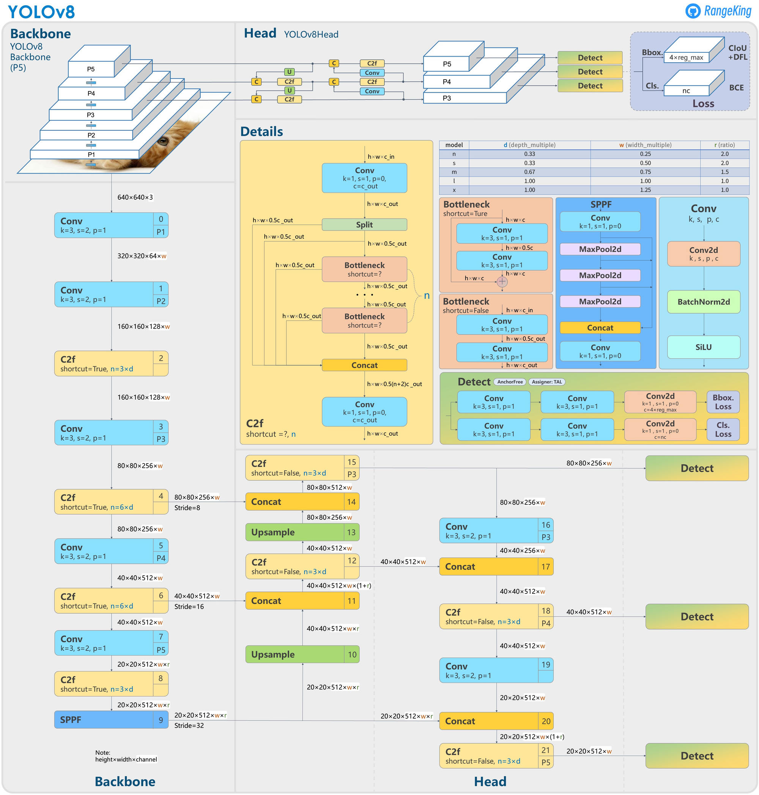

# 
Сравнение архитектур нейросетей, основанных на детекции объектов на изображениях
Датасет был взят с [<b>Kaggle</b>](https://www.kaggle.com/datasets/huanghanchina/pascal-voc-2012)

Из-за **несбалансированности** классов был написан [<b>класс датасета</b>](data_classes/custom_dataset.py) *PyTorch*, который возвращает все выборки (`train`, `valid`, `test`) со **стратифицированным** разбиением по классам, а так же имеет атрибут `df`, который хранит в себе объект `pandas.DataFrame` для конкретной выборки
## 
Faster R-CNN

Данная модель является двуступенчатой, поэтому требует много вычислительной мощности, но при этом даёт качественные результаты.

Ноутбук со всеми вычислениями и кодом [<b>тут</b>](frcnn.ipynb)

Использовался *fine-tuning* [<b>предобученной сети</b>](https://pytorch.org/vision/main/models/generated/torchvision.models.detection.fasterrcnn_resnet50_fpn_v2.html) из *PyTorch*. 

Обучение производилось на 3-ёх эпохах. *Learning rate* ($\eta$) был выбран довольно низким $2 \times 10^{-6}$

`DataLoader` для обучающей выборки был сэмплирован на основе веса каждого изображения. Подробнее в [<b>ноутбуке</b>](frcnn.ipynb)

Пример результата работы данной сети:

## 
YOLOv8

Данная модель является более быстрой, чем *Faster R-CNN*. Есть несколько предобученных вариантов, которые существенно отличаются количеством параметров в сети, то есть напрямую влияет на производительность.

Ноутбук со всеми вычислениями и кодом [<b>тут</b>](yolo.ipynb)

Мною была выбрана модель `yolov8m.pt` как "средний" вариант, в котором хорошо сбалансированы качество и производительность.

Дообучение производилось на 40-ка эпохах, при этом лучшая модель получилась уже в районе 15-20 эпох, потому что дальше началось переобучение

Пример результата работы данной сети **для изображений**:

**Для видео**:

## 
Сравнение результатов
|Архитектура|mAP@50|Скорость (1 изображение), сек|
|-|-|-|
|Faster R-CNN|0.644|0.195|
|YOLOv8|0.339|0.063|

Таким образом, если наиболее важна **точность** работы, то стоит выбирать двуступенчатые модели, такие как *Faster R-CNN*. 

Если же важна **скорость** работы (например, работа с видео в режиме реального времени), то отличным вариантом будут одноступенчатые модели, например, из семейства *YOLO*